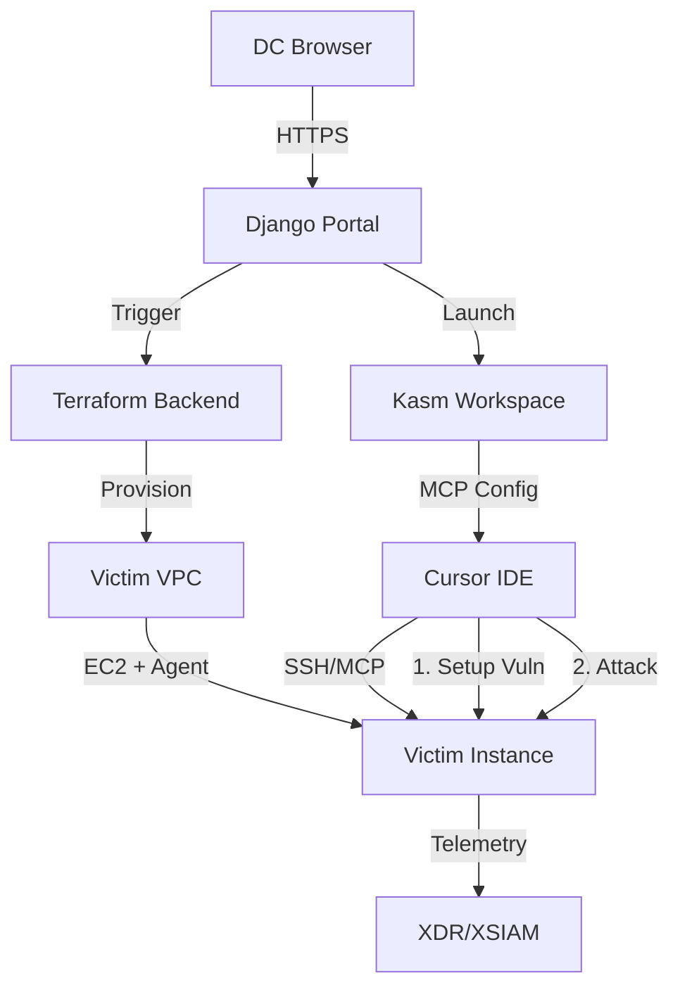

# Architecture

## Components

### Django Portal
- Authentication (paloaltonetworks.com email)
- Agent config management (upload XDR/XSIAM installers to S3)
- Range lifecycle (launch, destroy)

### Kasm Workspaces
- Containerized Kali desktop
- Cursor IDE with MCP servers
- Config injection at container launch

### Terraform Backend
- Per-DC victim VPC provisioning
- EC2 instance with user's agent
- Orchestrated via Step Functions

### MCP Servers
- `victim_run_command` - Execute commands on victim
- `victim_interactive_session` - Persistent SSH sessions
- Session management tools

## Data Flow

## Two-Context Pattern

- **Chat 1**: Configure vulnerability (defender context)
- **Chat 2**: Exploit vulnerability (attacker context, no memory of setup)
