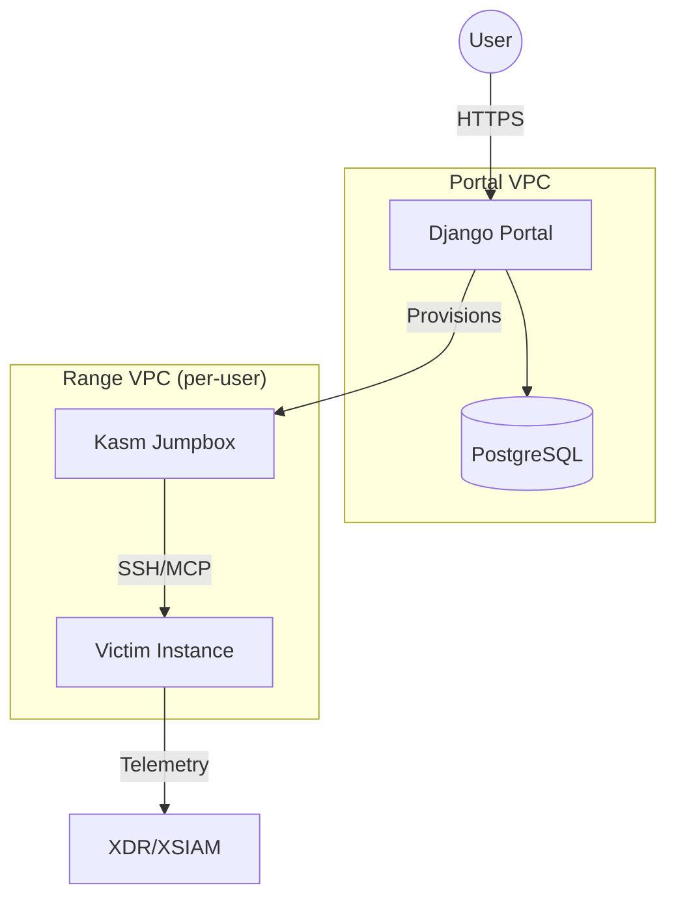
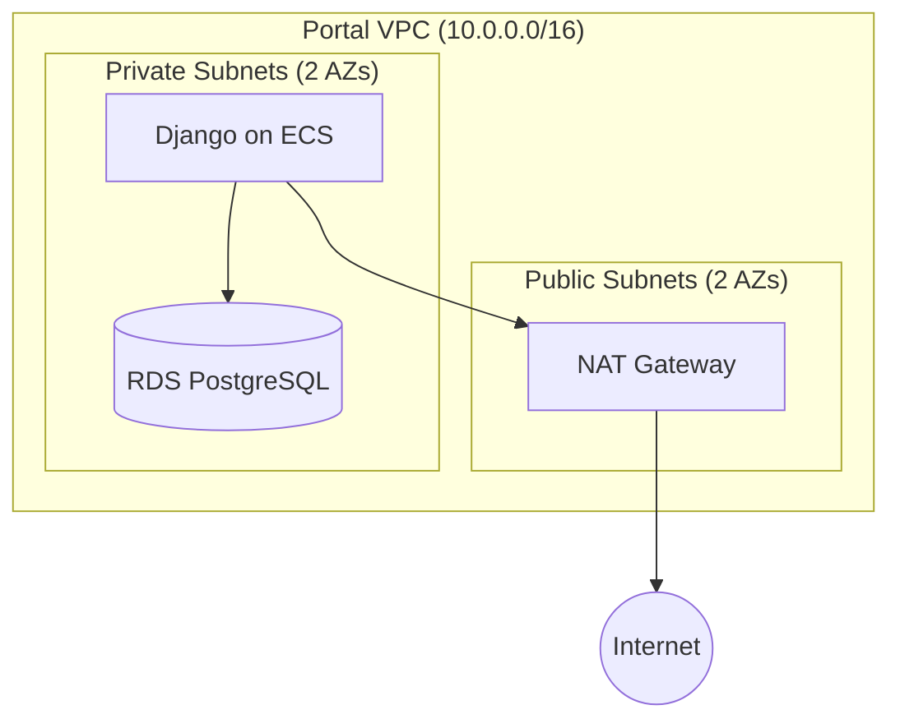
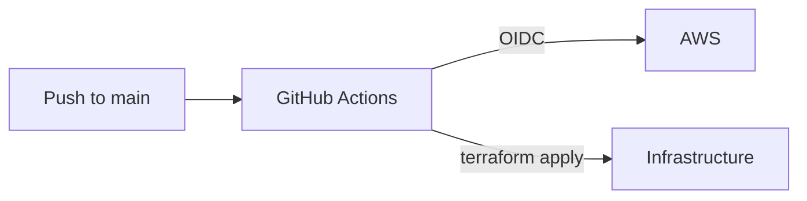

# Architecture

## Infrastructure Overview

Two isolated network domains:

- **Portal**: Shared infra running Django, RDS. Single VPC.
- **Range**: Per-user ephemeral VPCs with Kasm jumpbox and victim instances.



## Portal Infrastructure

### Network



Two AZs required for RDS subnet group. Single NAT gateway for cost optimization.

### Components

| Component | Purpose |
|-----------|---------|
| ECR | Container registry for Django image |
| VPC | Network isolation, public/private subnet separation |
| RDS | PostgreSQL 16, encrypted, credentials in Secrets Manager |

### Secrets Management

RDS credentials auto-generated at provision time, stored in Secrets Manager. Secret configured with `recovery_window_in_days = 0` to allow immediate deletion and avoid naming conflicts on destroy/recreate cycles.

## Range Infrastructure (TODO)

Per-user ephemeral VPCs provisioned via Step Functions when user launches a range.

Contains:

- Kasm container (Kali + Cursor + MCP)
- Victim EC2 instance with user's XDR agent

Isolated from portal VPC. No peering.

## Deployment Pipeline

GitHub Actions deploys via Terraform on merge to main.



IAM via OIDC federation. No static credentials. Role permissions scoped to shifter-* resources.

### Secrets Sync

Terraform variables stored locally in `.tfvars` files (gitignored). Synced to GitHub secrets before PR:

```bash
./scripts/sync-tfvars.sh
```

Creates namespaced secrets: `TF_VARS_{ENV}_{COMPONENT}` (e.g., `TF_VARS_PROD_PORTAL`).

## Two-Context Pattern

MCP enables AI-driven scenario setup:

1. **Setup chat**: Configure vulnerability on victim (defender context)
2. **Attack chat**: Exploit victim from Kasm (attacker context, no memory of setup)

XDR/XSIAM detects the attack, user demos to customer.
