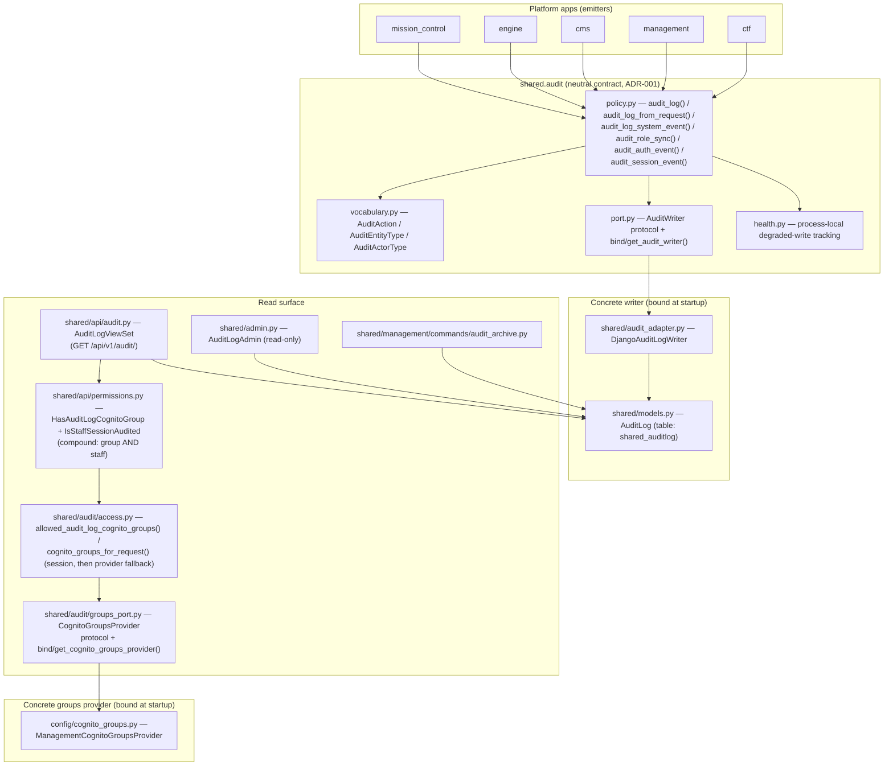

# Platform Audit System Architecture

Centralized audit logging for the Shifter platform, owned by the `shared` app
(`shared.audit` neutral contract + `shared.models.AuditLog` durable store).

This document was moved here from `docs/risk/audit-system-architecture.md`
and rewritten to describe the current, implemented architecture. The prior
version described a *target* design in which `risk_register` was the audit
hub; that was already stale after #1523 (the audit subsystem's neutral
contract moved to `shared`) and is fully retired by #1374, which removed the
Risk Register feature and rehomed the last risk-register-owned pieces
(`AuditLog`'s concrete Django writer, the read API, the archive command, and
the archival `APIKey` model) into `shared`.

## Current State

| Mechanism | Location | Scope | Storage |
|-----------|----------|-------|---------|
| `AuditLog` | `shared/models.py` (table `shared_auditlog`) | Platform-wide audit hub: range/credential/agent/user/session/ngfw/config/experiment/scenario/script lifecycle, authentication, authorization, role sync, and the archival API-key actor/entity | Database |
| `ActivityLog` | `management/models.py` | Agent upload/delete only | Database |

`AuditLog.entity_type` and `AuditLog.action` retain two retired historical
values, `"risk"` and `"comment"`, on rows written before #1374. No current
code emits them (`AuditEntityType.RISK` / `.COMMENT` were removed from the
active enum), but existing rows keep their stored values — the read API
declares `entity_type` / `action` as plain strings rather than inheriting the
model's `choices`, so the published OpenAPI contract does not claim a closed
enum that historical data violates (see `shared/api/audit.py`).

## Architecture

Every layer emits through `shared.audit`'s policy functions; none imports a
feature domain or the concrete writer directly. `config.apps.PortalConfig.ready()`
binds the one concrete writer (`shared.audit_adapter.audit_log_writer`) to the
neutral `AuditWriter` port at process startup — a missing or conflicting
binding is a startup configuration error, not a runtime fallback.

The read-side Cognito-group check needs the same neutrality: `shared` may not
import `management` (the layer contract in `.importlinter` /
`scripts/check_layer_imports/layer_imports.yaml` classifies `shared` as
`support_contracts`, forbidden from importing a domain package), but the
profile-fallback lookup requires `management.services.get_user_profile()`.
`shared/audit/groups_port.py` mirrors the writer port for exactly this reason:
`shared.audit.access` depends on the neutral `CognitoGroupsProvider` protocol,
and `config.apps.PortalConfig.ready()` binds the concrete
`config.cognito_groups.ManagementCognitoGroupsProvider` adapter at startup —
`config` is the composition layer allowed to import both `shared` and
`management.services`.

## Audit Failure Policy

Audit writes are mode-dependent (`shared/audit/policy.py`):

- **Strict** (`audit_log(event, strict=True)`, and always for
  `audit_role_sync()`): persistence failure is re-raised so callers fail
  closed and roll back the mutation the audit row would have described
  (issue #937 SEC-5). Used for safety-control writes such as `user_type` /
  CTF-group role sync.
- **Best-effort** (the default): a failed write never breaks the caller, but
  is not silent — it records bounded, process-local degraded state via
  `shared.audit.health.mark_audit_degraded()` and logs the exception.
- Degraded audit health is exposed through the existing `django-health-check`
  registry (`config.health_checks.AuditLogDegradedHealthCheck`). The public
  `/health` surface keeps its coarse body shape (`working` / `unavailable`)
  and never includes audit payloads, request data, or raw exception text.

A durable retry queue for non-strict audit writes is a separate design that
does not exist today: it would need its own queue storage, encryption,
retention, replay, and operator reset semantics.

## Vocabulary (`shared/audit/vocabulary.py`)

### Entity Types (`AuditEntityType`)

`apikey`, `range`, `credential`, `agent`, `user`, `session`, `ngfw`, `config`,
`experiment`, `scenario`, `script`.

Retired (historical rows only, no longer emitted): `risk`, `comment`.

### Action Types (`AuditAction`)

Lifecycle: `create`, `update`, `delete`, `restore`, `close`, `reopen`.
Authentication: `login`, `logout`, `login_failed`, `access_denied`.
Authorization: `role_sync`.
Sessions: `connect`, `disconnect`, `download`.
Resource lifecycle: `provision`, `deprovision`, `ready`, `failed`, `pause`,
`resume`, `cancel`, `recover`, `spare_provision`.

### Actor Types (`AuditActorType`)

`user`, `apikey`, `system`, `cognito`.

Values and labels are stable once shipped — historical rows and migrations
depend on them — so new members are additive, never renamed or re-valued.

## Emission API (`shared/audit/policy.py`)

- `audit_log(event: AuditEvent, *, strict: bool = False) -> bool` — the base
  entry point every other helper composes.
- `audit_log_from_request(request, entity_type, entity_id, action, ...)` —
  extracts actor, source IP (`shared.audit.attribution.get_client_ip()`,
  rightmost-trusted-hop policy), user agent, and request id
  (`get_request_id()`) from an `HttpRequest`.
- `audit_log_system_event(entity_type, entity_id, action, source, ...)` —
  attributes the event to `AuditActorType.SYSTEM` for provisioner/event-handler/
  scheduled-task callers.
- `audit_role_sync(...)` — strict-only helper for `user_type` / CTF-group
  membership changes.
- `audit_auth_event(...)` — login/logout/login_failed events.
- `audit_session_event(...)` — terminal/RDP connect/disconnect/access_denied.

All of these build an `AuditEvent` (`shared/audit/events.py`) and call
`audit_log()`; there is one event shape and one persistence path.

## Read Surface

- **REST API**: `shared/api/audit.py` — `AuditLogViewSet`
  (`ReadOnlyModelViewSet`), mounted at `/api/v1/audit/` from
  `shared.api.urls` (included by `config/api_urls.py`). Session-only: no
  platform API-token scope is accepted for audit reads. Authorization is a
  compound gate restoring the pre-#1374 risk-register semantics under an
  audit-owned name — `permission_classes = [HasAuditLogCognitoGroup,
  IsStaffSessionAudited]` (`shared/api/permissions.py`), and DRF requires
  every listed class to pass, so a session must be **both**:
  - a member of a Cognito group listed in `AUDIT_LOG_ALLOWED_COGNITO_GROUPS`
    (`shared.audit.access.allowed_audit_log_cognito_groups()`), resolved from
    `request.session["cognito_groups"]` first and falling back to the stored
    `UserProfile.cognito_groups` through the injected
    `shared.audit.groups_port.CognitoGroupsProvider` (bound to
    `config.cognito_groups.cognito_groups_provider` by
    `config.apps.PortalConfig.ready()`, the same seam used for the audit
    writer) when the session has never captured groups; **and**
  - staff or superuser (`IsStaffSessionAudited`).

  **Fails closed when unconfigured**: an empty/unset
  `AUDIT_LOG_ALLOWED_COGNITO_GROUPS` denies every principal, staff included —
  it is never a silent fallback to staff-only. Every denial (wrong group, no
  group config, non-staff, anonymous, any API token) emits an `ACCESS_DENIED`
  audit row via `shared.api.permissions.AuditedPermissionDenialMixin`, and the
  unconfigured case additionally logs an operator-legible warning
  (`shared.audit.access.log_audit_log_groups_unconfigured()`) so a 403 on a
  fresh install is diagnosable. Query params: `entity_type`, `entity_id`,
  `action`, `actor_type`, `actor_id`, `request_id`, `from_date`, `to_date`.

  **Upgrade note.** `AUDIT_LOG_ALLOWED_COGNITO_GROUPS` replaces the retired
  `RISK_REGISTER_ALLOWED_COGNITO_GROUPS`. Because the gate fails closed, a
  deployment that carries only the old variable forward starts cleanly and then
  returns 403 for every audit read. The variable is published in
  `config/env-manifest.json` (declared through `_EXPLICIT_BINDINGS` in
  `config/_env_manifest.py`, since a helper read is invisible to the manifest's
  AST walker), and the startup warning names the retired variable so the rename
  is discoverable from the running process.
- **Django admin**: `shared/admin.py` — `AuditLogAdmin`. Read-only (no
  add/change/delete); filter by action/entity_type/actor_type/timestamp,
  search by context/request_id/source_ip, date hierarchy by timestamp.
- **Archive command**: `shared/management/commands/audit_archive.py` —
  batches rows older than `--retention-days` (default 90) to gzipped JSON
  Lines in the existing log-aggregation S3 bucket
  (`s3://{bucket}/audit-archive/{year}/{month}/audit_{start}_{end}.jsonl.gz`),
  then deletes the archived rows unless `--no-delete`. Supports `--dry-run`
  and `--batch-size`. Bucket resolution: `LOGS_BUCKET_NAME` /
  `AUDIT_ARCHIVE_BUCKET` (setting or environment variable); an
  `ExpectedBucketOwner` defense-in-depth check runs via STS when
  `AWS_ACCOUNT_ID` is not set explicitly.

## Security Considerations

1. **Immutability**: no update/delete path exists in admin or API.
2. **Access control**: the read API requires a session that is both
   staff/superuser and a member of a configured Cognito group
   (`AUDIT_LOG_ALLOWED_COGNITO_GROUPS`); an unconfigured allow-list fails
   closed (denies everyone) rather than degrading to staff-only. No token
   scope is accepted (deliberate — programmatic audit reads stay absent
   unless a dedicated audit-read scope is explicitly added later).
3. **PII**: `actor_id` references a user id; no email or free-text PII is
   required in `context`/`previous_state`/`new_state`, and callers must not
   place credentials, tokens, cookies, or secrets in those fields
   (`shared.log_sanitize` covers logging, not audit-row content — callers are
   responsible for what they pass into `AuditEvent`).
4. **Request attribution**: `source_ip` comes from
   `shared.audit.attribution.get_client_ip()`'s configured trusted-proxy
   policy, never a view-local XFF parser.

## Compliance Mapping

| Requirement | `AuditLog` field |
|-------------|----------------|
| Who | `actor_type`, `actor_id` |
| What | `entity_type`, `entity_id`, `action` |
| When | `timestamp` |
| Where | `source_ip` |
| How | `user_agent`, `context` |
| Before/After | `previous_state`, `new_state` |

## Canonical Implementation Points

| File | Responsibility |
|------|---------|
| `shared/audit/vocabulary.py` | Owns `AuditAction` / `AuditEntityType` / `AuditActorType`. Extend here only when an existing enum member cannot represent the event; values/labels are additive-only. |
| `shared/audit/policy.py` | Owns `audit_log()` and the request/system/role-sync/auth/session emission helpers, and the strict/best-effort failure policy. |
| `shared/audit/port.py` | Owns the neutral `AuditWriter` protocol and the startup writer binding. |
| `shared/audit/attribution.py` | Owns trusted client-IP resolution and request-id correlation. |
| `shared/audit/health.py` | Owns process-local degraded-audit-write tracking, read by `config.health_checks`. |
| `shared/audit_adapter.py` | The one concrete `AuditWriter`: persists `AuditEvent` to `shared.models.AuditLog`. Bound at startup by `config.apps.PortalConfig.ready()`. |
| `shared/models.py` | Owns the `AuditLog` ORM model (table `shared_auditlog`) and the archival `APIKey` model. |
| `shared/api/audit.py` | Owns the read-only `/api/v1/audit/` API. |
| `shared/api/permissions.py` | Owns `HasAuditLogCognitoGroup` (audit-log Cognito-group gate) and `IsStaffSessionAudited` (staff/superuser gate); composed as the compound `permission_classes` on `AuditLogViewSet`. |
| `shared/audit/access.py` | Owns `allowed_audit_log_cognito_groups()` and the session-then-provider Cognito-groups resolution consumed by `HasAuditLogCognitoGroup`. |
| `shared/audit/groups_port.py` | Owns the neutral `CognitoGroupsProvider` protocol and the startup provider binding (mirrors `shared/audit/port.py`). |
| `config/_audit_settings.py` | Owns `AUDIT_LOG_ALLOWED_COGNITO_GROUPS` (split-settings module, star-imported by `config/settings.py`). |
| `config/cognito_groups.py` | Owns `ManagementCognitoGroupsProvider`, the concrete `CognitoGroupsProvider` bound at startup, and the session/profile Cognito-group capture (`sync_cognito_groups_from_claims`) it reads. |
| `shared/admin.py` | Owns the read-only `AuditLogAdmin`. |
| `shared/management/commands/audit_archive.py` | Owns S3 archival of aged rows. |
| `config/health_checks.py` | Registers `AuditLogDegradedHealthCheck` against the coarse `/health` surface. |
| `mission_control/views/_common.py` | Owns `_audit_range_lifecycle()`, the shared HTTP request-context audit helper for range lifecycle endpoints. |
| `cms/services.py` facade | Public cross-layer service seam other layers call into for range/credential/NGFW mutations that emit audit rows; callers should use this facade, not private CMS submodules. |
| `engine/handlers.py`, `cms/handlers/range_events.py` | Own system/event-driven lifecycle status convergence and use the system audit helpers for new audited event-handler actions. |
| `mission_control/consumers.py` | Owns terminal/RDP session audit events. |
