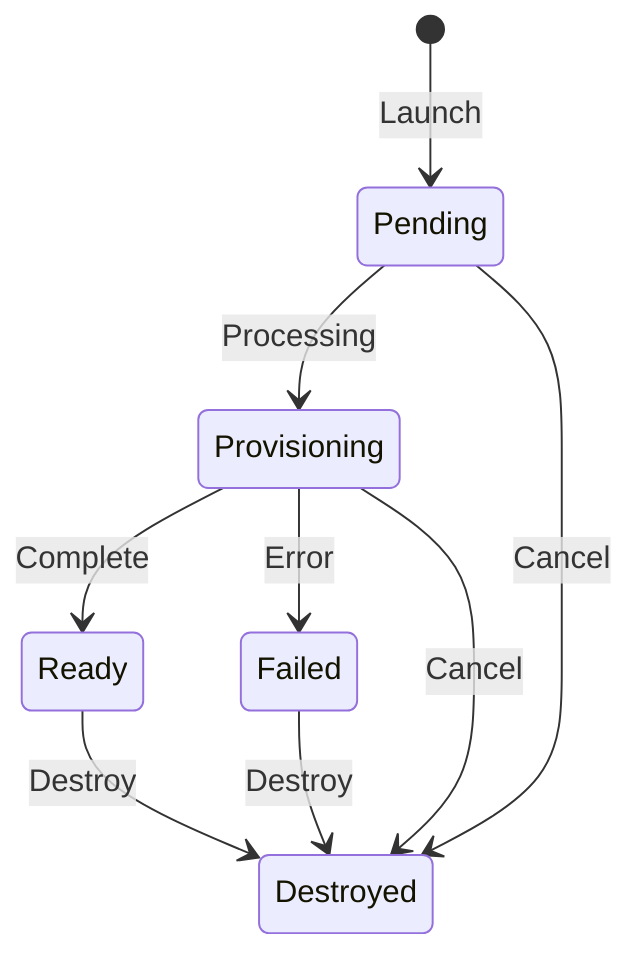

# Ranges

Launch and manage isolated demo environments.

## Range Lifecycle

## Status Reference

| Status | Meaning |
|--------|---------|
| Pending | Queued for provisioning |
| Provisioning | Infrastructure being created |
| Ready | Range is live, accessible |
| Failed | Provisioning error occurred |
| Destroyed | Range terminated |

## Launch a Range

1. Go to **Ranges page**
2. Select a scenario
3. Select an agent
4. Click **Launch Range**

Provisioning takes about 10 minutes.

## Monitor Provisioning

The Ranges page shows real-time status updates during provisioning. You'll see progress as instances are created and configured.

## Access a Range

Once Ready:

1. Go to **Terminal**
2. Select an instance
3. Use SSH or RDP to connect

When the active range advertises VPN access, Mission Control also offers a
**Download VPN profile** action. Treat the `.ovpn` file as a private credential.

See [Terminal](terminal) for details.

## Range Lifetime

Mission Control ranges start with a 30-day lifetime. The SPA shows both the time
remaining and the scheduled cleanup time on the active range page. Use
**Extend by up to 30 days** to extend the deadline, up to the range's fixed
365-day maximum lifetime. Expired ranges are automatically destroyed.

CTF participant and spare ranges use the CTF event cleanup time as their
deadline and are removed automatically through the same range cleanup process.

## Cancel a Range

While in Pending or Provisioning status:

1. Go to **Ranges page**
2. Click **Cancel** on the range

## Destroy a Range

When finished:

1. Go to **Ranges page**
2. Click **Destroy** on the range

This is irreversible. All range data is deleted.

## Warm pool for faster initial launch

A deployment can keep a **warm pool** of pre-provisioned, system-owned ranges so an
initial launch is handed a ready range instead of waiting for cold provisioning.
Warm pooling is **disabled by default**; an operator enables it in `shifter.yaml`
under `settings.warm_pool`.

How it behaves:

- Launch first tries to atomically claim a compatible ready range from the pool. On
  a hit, the range is transferred to the launching user with **fresh, fully
  re-established credentials and access**. No prior tenant's data, credentials, or
  sessions cross the ownership boundary. On a miss (empty pool, an incompatible
  request, or a backend without warm support), launch **falls back to normal cold
  provisioning** with no change in behavior.
- Compatibility is decided by the exact immutable launch inputs (backend, region,
  scenario package/lock digest, purpose, access posture). A scenario, image, or
  config change makes older ready ranges incompatible; the pool retires them and
  prepares new ones.
- **Supported backends:** the GCE range-cell backend is warm-capable today. AWS and
  the retained GDC substrate report warm activation as unsupported and always
  cold-provision (AWS support is tracked separately).

Sizing and cost:

- Each bucket declares a `target`, `minimum`, and `maximum` ready count and a warm
  idle lifetime. Warm ranges **count against provider capacity and cost admission**
  exactly like a launched range. A warm pool trades standing cost for lower launch
  latency, so size `target` to your expected concurrent cold-start demand, not
  higher.
- A capacity or cost ceiling can hold the pool below `minimum`; the reconciler
  alerts rather than exceeding a ceiling.
- Metrics are published to the `Shifter/WarmPool` namespace: ready / provisioning /
  unhealthy counts, claim hit and fallback rates, and idle age, per bucket and
  backend/region.

This warm pool is distinct from the CTF **recovery-spare** pool (see the CTF
organizer guide): recovery spares replace a *failed participant range mid-event*,
while the warm pool speeds up *initial* launches. The two are configured and
accounted separately.

## Limits

- One active range at a time per user
- Mission Control ranges cannot be extended past 365 days from creation
- Warm-pool claims apply to RAES-native (GCE) initial launches; other backends
  cold-provision.
