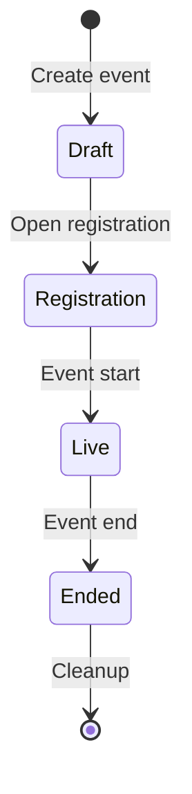

# CTF Organizer Guide

How to run a capture-the-flag event end to end. The organizer surface lives under the
**CTF Admin** area of the portal (`/ctf/admin/`) and is restricted to users with CTF
organizer access.

## Event Lifecycle

## 1. Create the Event

From **CTF Admin → Events → Create**, set the core parameters:

| Setting | Purpose |
|---------|---------|
| Name / description | Shown to participants |
| Scenario | The range scenario each participant gets |
| Event start / end | Competition window |
| Registration deadline | Latest time a participant may register |
| Max participants | Capacity limit |
| Team mode / team size | Individual vs. team competition |
| Range spin-up minutes | Lead time to provision ranges before start |
| Submission cooldown / attempt limit | Anti-brute-force throttles |
| Scoreboard visibility / freeze | Whether and when standings are shown |
| Auto cleanup / cleanup delay | Whether ranges are torn down after the event |

## 2. Add Challenges

Under an event, **Challenges → Create**. For each challenge set its name, category,
description, points, difficulty, and the flag. Flags are stored as a salted hash, so
the plaintext flag is never persisted after creation.

Additional controls:

- **Release time** — schedule a challenge to appear partway through the event.
- **Prerequisite** — lock a challenge until another is solved.
- **Visibility** — hide a challenge from the participant list until you release it.
- **Target instance / port** — point participants at the right host in their range.
- **Files** — upload challenge attachments.
- **Hints** — optional, point-reducing hints.

A challenge can carry multiple flags (for multi-stage solves), each validated
independently.

## 3. Manage Participants

From an event's **Participants** page you can add participants individually or bulk
import a roster. Each participant is tracked through registration, range assignment,
and scoring. Use **Brackets** to group participants into ranked cohorts, and (in team
mode) manage team membership.

## 4. Ranges

The **Ranges** page shows the provisioning state of every participant's range. The
platform provisions ranges automatically around the spin-up window and, when auto
cleanup is enabled, tears them down after the event. The CTF scheduler drives batch
provisioning; see the technical
[CTF documentation](../technical/shifter_platform/ctf) for how it runs.

## 5. Notifications

Use **Notifications** to send announcements during the event and **Email Templates**
to configure reminder messages. Events can also send registration reminders at the
hour offsets you configure.

## 6. During and After the Event

- The **Scoreboard** updates as submissions land. Freeze it near the end to keep final
  standings suspended until close.
- **Analytics** summarizes solves, attempts, and challenge difficulty in practice.
- After the event, scoring can be recomputed authoritatively if needed (see the
  technical docs for the leaderboard recompute command).

## See Also

- [CTF](ctf) — the participant experience.
- [CTF technical documentation](../technical/shifter_platform/ctf) — models, services,
  scheduling, and range provisioning.
